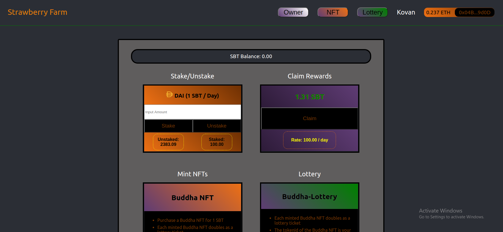

# Strawberry Farm



This repository provides a DAI staking mechanism; whereby, the user receives StrawberryToken as a reward for staking DAI in the contract. Further, the user can purchase a NFT through the NFT factory named Buddha Nft. The StrawberryTokens are sent to a lottery pool inside the Lottery contract. Finally, each NFT includes a tokenId which acts as a lottery ticket. The lottery feature uses Chainlink's VRF to provide a verifiably random number. The winner receives the contents of the lottery pool. 

## Tutorial URL
https://medium.com/coinmonks/yield-farming-tutorial-part-1-3fd5972ce717

https://medium.com/coinmonks/yield-farming-tutorial-part-2-ea5b5254805d

https://medium.com/coinmonks/yield-farming-tutorial-part-3-53dd62bc7819

***

## Deployment
### Prerequisites
This dApp accepts DAI as its staking token; therefore, you'll need to acquire Kovan DAI if you deploy to Kovan (as it's preconfigured). To attain kDAI, you'll need to lock kETH in a Maker vault in exchange for kDAI.
* Network Provider
    * Infura.io
    * Alchemy.com
* MetaMask 
    * MetaMask.io
* Kovan DAI 
    * https://oasis.app/borrow?network=kovan
* Kovan LINK
    * https://kovan.chain.link/

The Hardhat configuration file and scripts have been set up to deploy on the Kovan testnet. Use the .env_sample as a template for the requisite API_KEY and PRIVATE_KEY. Infura and Alchemy offer free API access to testnets and mainnet. Once you have an API endpoint and your private key from MetaMask, create a dotenv file within the StrawberryFarm root:

```
touch .env
```
Populate the .env with your API_KEY and PRIVATE_KEY. 
<br>
_*If you're posting on GitHub, DO NOT FORGET to .gitignore the dotenv(.env) file!_
<br>
<br>
Uncomment out the Kovan network details in hardhat.config.ts:
```
networks: {
    kovan: {
        gas: "auto",
        gasPrice: "auto",
        url: process.env.API_KEY,
        accounts: [`0x${process.env.PRIVATE_KEY}`]
    }
  }
```
In the root, run:
```
npx hardhat run scripts/deployFarm.ts --network kovan
```
Deployed Addresses:
```
SbtToken address: 0x4053bb32815bfCD504328549B73B36Ee6e46086a
BuddhaNft address: 0x85CD0a201E2561b37e62fccd57480aA6E4F821C7
Lottery contract address: 0xbb3b9d376C1faA01B770b40C4449E3A6530bd972
SbtFarm address: 0x2458C656619c7afD61886E2E4b2b27BFe23Ea962
NFT Price: 1.0 SBT
SBTToken minter role transferred to: 0x2458C656619c7afD61886E2E4b2b27BFe23Ea962
Buddha NFT minter role transferred to 0x2458C656619c7afD61886E2E4b2b27BFe23Ea962
```


